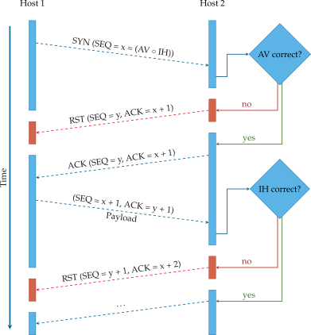

# TCP Stealth

TCP Stealth is an RFC draft and an extension for the Linux kernel providing a modern version of port knocking for TCP sockets. Unlike other approaches, `TCP_Stealth` is safe against active MitM attacks, is able to ensure the integrity of the first TCP segment sent after the handshake, and requires only minimal changes to existing applications (`setsockopt`).

The TCP Initial Sequence Number (ISN) of the connection initiator is chosen in such a way that it conveys authentication (AV) and integrity (IH) information to the connection responder. Both sides need to be in possession of a symmetric pre-shared key to use TCP Stealth.



## Repository Organization

```
.
├── examples             # Example of userspace code using TCP Stealth
├── isn_algorithm        # Userspace implementation of the ISN generation aglrothm
├── kernel_patches       # Patches for various (ancient) Linux kernels implementing TCP Stealth
├── libknockify          # LD_PRELOAD library to add TCP Stealth to existing code without recompiling
├── nat_tester           # Helper utility to determine middle box ISN rewriting behaviour
└── third_party_patches  # Patches adding TCP Stealth to OpenSSH and systemd
```

## Further Reading

- [Thesis](https://kirschju.re/docs/kirsch-2014-kernel-port-knocking.pdf) explaining the idea
- [RFC draft](https://datatracker.ietf.org/doc/draft-kirsch-ietf-tcp-stealth/) outlining the changes to the TCP protocol

