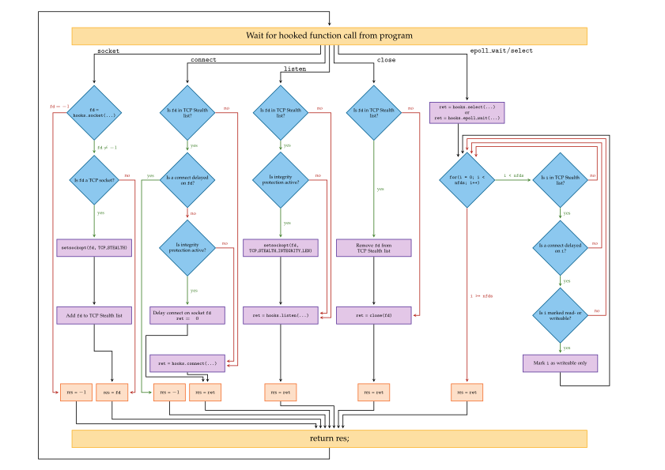

# libknockify

This is a `LD_PRELOAD` library for Linux that allows to enable TCP Stealth for
existing applications without recompiling them.

## Compiling

Simply type

```
make
```

into a command prompt.

## Usage

```
LD_PRELOAD=./libknockify.so <program-to-knockify>
```

## Run-Time Options

| `VARIABLE=value`       | Description                                                                                |
|------------------------|--------------------------------------------------------------------------------------------|
| `KNOCK_SECRET=string`  | sets the TCP Stealth secret                                                                |
| `KNOCK_INT_LEN=number` | number of bytes that should be integrity protected (0 means no integrity protection)       |
| `KNOCK_LOGLVL=number`  | adjusts the amount of messages produced by libknockify (0 means silent, 3 is very verbose) |

All options can be specified either as environment variables or as key-value pairs of the form `key=value` in a file called `.knockrc` residing in your `$HOME` directory.

## Internals

The following diagram shows how the `socket`, `connect`, `listen`, `close`,
`epoll_wait`, and `select` library functions are shadowed:



The following diagram shows how the `getsockopt`, `send`, `write`, and `sendto`
library functions are shadowed:


